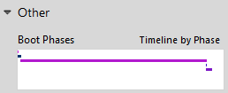
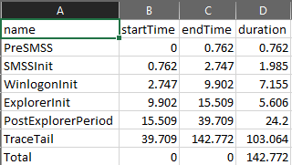
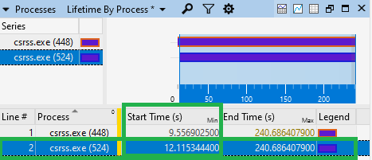
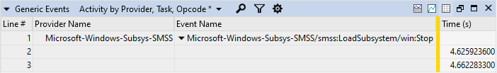
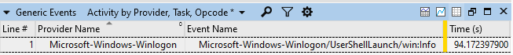
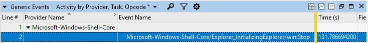
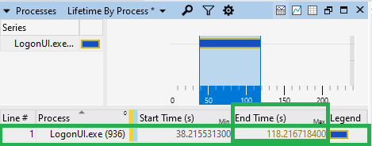

# Boot trace phases

Wpa.exe boot analysis

If the Boot Phases graph is unavailable, use the below information to find the durations of each boot phase.

Alternativley, the [ETLReports](https://github.com/itoleck/ETLReports) tool can be used to create a .csv file and .png file of the boot phase information. The Windows Performance Toolkit application, xperf.exe can also create an .xml report using actions. See **xperf.exe -help processing** for more information.

.\etlreports.exe --infile:<.etl file path> --processor:bootphases --outfile:<output directory>

Example ETLReports output:

 

|       **Phase**      | **Normal Duration** | **Start of boot phase** | **End of boot phase** | **Notes** |
| ---------------------|---------------------|-------------------------|-----------------------|-----------|
| Pre-Session Init     | 0-9s | Beginning of boot trace | First Smss.exe process starts  | This boot phase starts after the BIOS/UEFI ends and the kernel loads. This phase should only take low single digit seconds to complete. |
| Session Init         | 0-12s | First Smss.exe process starts  | Second Csrss.exe process starts   or all Microsoft-Windows-Subsys-SMSS/smss:LoadSubsystem/win:Stop(s) end  | This phase should only take single digit seconds to complete. |
| WinLogon Init        | 10-60s | Second Csrss.exe process   or first LogonUI.exe starts   or all Microsoft-Windows-Subsys-SMSS/smss:LoadSubsystem/win:Stop(s) end  | Process/explorer.exe Start Time (s)   or Microsoft-Windows-Winlogon/UserShellLaunch/win:Info  | This is usually the longest of the boot phases as it encapsulates the starting of sessions, services and any Group Policies/scripts. A performant mean time for this boot phase is ~30 seconds. |
| Explorer Init        | 0-6s | Microsoft-Windows-Shell-Core/Explorer_InitializingExplorer/win:Start  or Process/explorer.exe Start Time (s)  | Microsoft-Windows-Shell-Core/Explorer_InitializingExplorer/win:Stop  or last LogonUI.exe process ends  | This boot phase starts after a user has logged on the machine. The shell(Explorer) and any startup applications start in this phase. This phase should only take single digit seconds to complete. |
