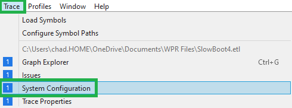

# WPA First Steps of Analyzing a Performance Trace

## Steps

1. [Understand the system](#understand)
2. 
3. 

### Understand the system ###

The System Configuration window has all kinds of information about the machine and conditions of the trace. This is the first place to start in any investigation of an .etl file with Windows Performance Analyzer(WPA.exe).
To open the System Configuration, open a trace and go to the Menu->Trace->System Configuration.
